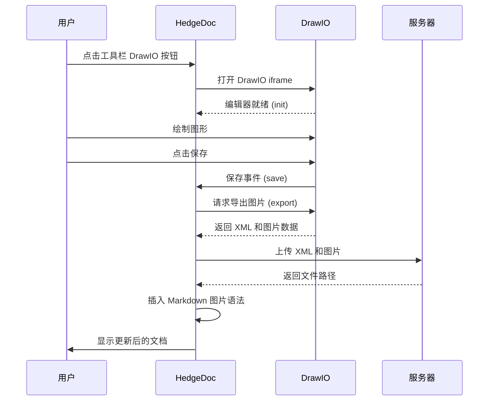
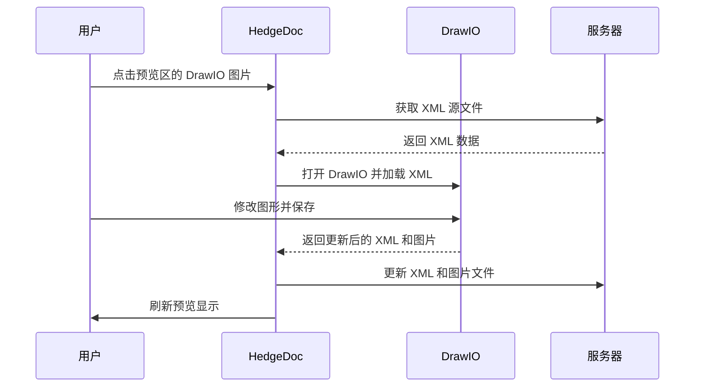

# HedgeDoc + DrawIO 集成项目

> 将 DrawIO 图形编辑器无缝集成到 HedgeDoc 协作 Markdown 编辑器中，支持一键 Docker 部署。
https://hub.docker.com/r/nabule/hedge_drawio

## 1. 项目介绍

本项目实现了 **HedgeDoc** 与 **DrawIO** 的深度集成，让用户可以在协作编写 Markdown 文档的同时，方便地创建和编辑专业的流程图、架构图等图形。

### 核心特点

- **全本地部署**：所有服务均可在本地 Docker 容器中运行，无需外部依赖
- **实时协作**：基于 HedgeDoc 的实时协作编辑能力
- **无缝集成**：在 HedgeDoc 编辑器工具栏直接插入 DrawIO 图形
- **二次编辑**：点击已插入的图形即可再次编辑
- **多格式支持**：支持 PNG 和 SVG 两种图形导出格式

## 2. 项目功能

### 2.1 基础功能

| 功能 | 说明 |
|------|------|
| ✅ 协作编辑 | 多人实时协作编辑 Markdown 文档 |
| ✅ 匿名访问 | 支持匿名用户创建和编辑文档 |
| ✅ 用户注册 | 支持邮箱注册账号 |

### 2.2 DrawIO 集成功能

| 功能 | 说明 |
|------|------|
| ✅ 插入图形 | 工具栏一键插入 DrawIO 图形 |
| ✅ 弹窗编辑 | DrawIO 编辑器以弹窗形式打开，支持调整大小和最大化 |
| ✅ 二次编辑 | 点击已插入的图形可再次编辑 |
| ✅ PNG 导出 | 支持将图形导出为 PNG 格式 |
| ✅ SVG 导出 | 支持将图形导出为 SVG 格式（浅色外观、嵌入图片和字体） |
| ✅ 格式配置 | 支持通过环境变量配置导出格式（PNG/SVG）及选项 |

### 2.3 文件管理功能

| 功能 | 说明 |
|------|------|
| ✅ 文件列表 | 查看所有 DrawIO 文件（原始 XML 和渲染图片） |
| ✅ 孤立检测 | 自动检测未被任何文档引用的孤立文件 |
| ✅ 批量清理 | 一键清理所有孤立文件，释放存储空间 |
| ✅ 文件下载 | 支持下载原始 XML 文件和渲染后的图片 |

### 2.4 文档导出功能

| 功能 | 说明 |
|------|------|
| ✅ 文档打包 | 将文档及所有关联的 DrawIO 文件打包为 ZIP |
| ✅ 原始文件 | 导出包含 DrawIO 原始 XML 文件 |
| ✅ 渲染图片 | 导出包含渲染后的图片文件 |

### 2.5 自定义 URI 功能

| 功能 | 说明 |
|------|------|
| ✅ 直接访问 | 通过自定义 URI 直接访问或创建文档 |
| ✅ 自动创建 | 访问不存在的 URI 时自动创建新文档 |
| ✅ 访客支持 | 未登录用户也可使用自定义 URI 创建文档 |

---

## 3. 使用方法

### 3.1 部署方式

#### 方式一：使用离线发布包（推荐）

适用于离线环境或希望快速部署的场景。

##### 前置要求

- Docker 已安装
- docker compose 已安装

##### 部署步骤

1. **获取发布包**

   从 `release/` 目录获取最新版本的发布包（如 `v1.0.0`），包含以下文件：
   ```
   v1.0.0/
   ├── README.md           # 部署说明
   ├── deploy.sh           # 一键部署脚本
   ├── docker-compose.yml  # Docker Compose 配置
   ├── hedgedoc.tar        # HedgeDoc 镜像（含 DrawIO 集成）
   ├── drawio.tar          # DrawIO 编辑器镜像
   └── postgres.tar        # PostgreSQL 数据库镜像
   ```

2. **复制到目标机器**

   将整个版本目录复制到目标服务器。

3. **运行部署脚本**

   ```bash
   chmod +x deploy.sh
   ./deploy.sh
   ```

   脚本将自动完成：
   - 加载 Docker 镜像
   - 验证镜像完整性
   - 启动所有服务

##### 访问服务

部署完成后，通过以下地址访问：

| 服务 | 地址 |
|------|------|
| HedgeDoc | http://localhost:3000 |
| DrawIO | http://localhost:8180 |

#### 方式二：从源码构建

适用于需要对 HedgeDoc 进行二次开发或源码修改的场景。

```bash
# 1. 克隆仓库
git clone <repository_url>
cd hedge_drawio

# 2. 构建 HedgeDoc 镜像
./build.sh hedgedoc

# 3. 启动服务
docker compose up -d
```

### 3.2 数据持久化

数据通过本地目录映射持久化存储在项目的 `data/` 目录下，容器重启后数据不会丢失，且可以直接在宿主机访问和管理文件。

#### 目录结构

```
data/
├── database/               # PostgreSQL 数据库文件
└── uploads/                # 上传文件和 DrawIO 文件
    ├── *.png, *.jpg, *.svg     # 普通上传图片
    ├── drawio-*.svg            # DrawIO 渲染图片（SVG 格式）
    ├── drawio-*.png            # DrawIO 渲染图片（PNG 格式）
    └── drawio/                 # DrawIO 原始文件
        └── drawio-*.xml        # DrawIO XML 源文件
```

#### 首次部署权限设置

首次部署时，需要设置 `data/uploads` 目录的写入权限，否则容器内进程无法写入文件：

```bash
# 创建目录
mkdir -p data/database data/uploads/drawio

# 设置权限（方式一：开放权限，适用于开发环境）
chmod -R 777 data/uploads

# 设置权限（方式二：指定 UID，适用于生产环境）
# 容器内 HedgeDoc 进程通常以 UID 10000 运行
sudo chown -R 10000:10000 data/uploads
```

> **注意**：如果遇到 "保存失败: 上传失败: Internal Server Error" 错误，通常是权限问题，请检查 `data/uploads` 目录的写入权限。

#### 数据备份

```bash
# 备份整个 data 目录
tar cvf hedge_drawio_backup.tar data/
```

#### 数据恢复

```bash
# 恢复 data 目录
tar xvf hedge_drawio_backup.tar
```

### 3.3 常用运维命令

```bash
# 查看服务状态
docker compose ps

# 查看服务日志
docker compose logs -f

# 查看指定服务日志
docker compose logs -f hedgedoc

# 重启服务
docker compose restart

# 停止服务
docker compose down

# 停止并删除数据卷（危险！会清除所有数据）
docker compose down -v
```

### 3.4 环境变量配置

在 `docker-compose.yml` 中可配置以下重要环境变量：

| 变量 | 默认值 | 说明 |
|------|--------|------|
| `CMD_DOMAIN` | `localhost` | 服务域名 |
| `CMD_URL_ADDPORT` | `true` | URL 是否添加端口号 |
| `CMD_ALLOW_ANONYMOUS` | `true` | 允许匿名访问 |
| `CMD_ALLOW_ANONYMOUS_EDITS` | `true` | 允许匿名编辑 |
| `CMD_ALLOW_EMAIL_REGISTER` | `true` | 允许邮箱注册 |
| `CMD_ALLOW_FREEURL` | `true` | 启用自定义 URI 功能 |
| `CMD_REQUIRE_FREEURL_AUTHENTICATION` | `false` | 自定义 URI 是否需要登录 |
| `CMD_DRAWIO_EXPORT_FORMAT` | `svg` | DrawIO 导出格式 (svg/png) |
| `CMD_DRAWIO_KEEP_THEME` | `false` | 是否保留编辑器主题颜色 (true/false) |

---

## 4. 用户使用指南

### 4.1 插入 DrawIO 图形

1. 在 HedgeDoc 中打开或创建文档
2. 进入**编辑模式**（双栏或纯编辑视图）
3. 点击工具栏中的 **DrawIO 图标**（📊）
4. 在弹出的 DrawIO 编辑器中绘制图形
5. 点击**保存并退出**，图形将自动插入到文档中

### 4.2 编辑已有图形

1. 切换到双栏编辑模式
2. 在**预览区域**中点击 DrawIO 图形
3. DrawIO 编辑器将自动打开并加载图形
4. 修改后保存，文档中的图形将自动更新

### 4.3 DrawIO 文件管理

访问路径：`http://localhost:3000/drawio-manager`（需登录）

#### 功能说明

- **文件列表**：显示所有 DrawIO 文件及其状态
  - 原始 XML 文件路径
  - 渲染后的图片文件路径
  - 关联状态（是否被文档引用）
  
- **下载文件**：
  - 下载原始 XML 文件（可用 DrawIO 桌面版再次编辑）
  - 下载渲染后的图片文件

- **孤立文件清理**：
  - 系统自动检测未被任何文档引用的孤立文件
  - 可单个删除或批量清理孤立文件
  - 清理前会显示将释放的存储空间

### 4.4 自定义 URI 访问

启用 `CMD_ALLOW_FREEURL=true` 后，可通过自定义 URI 访问文档：

```
http://localhost:3000/my-custom-doc
```

- 如果文档存在，直接打开
- 如果文档不存在，自动创建新文档

### 4.5 文档打包下载

在文档页面，点击工具栏的**下载**按钮，可将文档及所有关联文件打包为 ZIP 下载。

ZIP 包内容：
- `document.md` - Markdown 源文件
- `drawio/` - DrawIO 原始 XML 文件
- `images/` - 渲染后的图片文件

---

## 5. 技术实现说明

### 5.1 项目架构

```
┌─────────────────────────────────────────────────────────────┐
│                      用户浏览器                              │
└─────────────────────────────────────────────────────────────┘
                              │
          ┌───────────────────┼───────────────────┐
          ▼                   │                   ▼
   ┌─────────────┐            │           ┌─────────────┐
   │  HedgeDoc   │◄───────────┼───────────│   DrawIO    │
   │   :3000     │   postMessage API      │    :8180    │
   └─────────────┘            │           └─────────────┘
          │                   │
          ▼                   │
   ┌─────────────┐            │
   │ PostgreSQL  │            │
   │   :5432     │            │
   └─────────────┘            │
          │                   │
          ▼                   ▼
   ┌─────────────────────────────────────────────────────────┐
   │                  Docker Named Volumes                   │
   │  ┌───────────────┐        ┌───────────────────────────┐ │
   │  │   database    │        │         uploads           │ │
   │  │ (PostgreSQL)  │        │ (图片 + DrawIO 文件)       │ │
   │  └───────────────┘        └───────────────────────────┘ │
   └─────────────────────────────────────────────────────────┘
```

### 5.2 核心模块说明

#### DrawIO 编辑器集成 (`hedgedoc/public/js/lib/editor/drawio.js`)

- **通信方式**：通过 iframe 嵌入 DrawIO 编辑器，使用 `postMessage` API 进行双向通信
- **主要功能**：
  - `DrawioEditor.open()` - 打开编辑器（新建或编辑已有图形）
  - `DrawioEditor.handleMessage()` - 处理 DrawIO 返回的消息
  - `DrawioEditor.uploadToServer()` - 上传 XML 和图片到服务器

#### 工具栏集成 (`hedgedoc/public/js/lib/editor/ui-elements.js`)

- 在 HedgeDoc 编辑器工具栏添加 DrawIO 插入按钮
- 为预览区域的 DrawIO 图片添加点击事件监听器

#### 文件管理路由 (`hedgedoc/lib/web/drawioManagerRouter.js`)

- **路由端点**：
  - `GET /drawio-manager` - 管理页面
  - `GET /api/drawio/files` - 获取文件列表
  - `GET /api/drawio/orphans` - 获取孤立文件
  - `DELETE /api/drawio/files/:fileId` - 删除文件
  - `POST /api/drawio/cleanup` - 批量清理孤立文件
  - `GET /api/drawio/download/:fileId/xml` - 下载 XML 文件
  - `GET /api/drawio/download/:fileId/image` - 下载图片文件

#### 文件存储结构

```
/hedgedoc/public/uploads/
├── drawio-{uuid}.png      # PNG 格式渲染图片
├── drawio-{uuid}.svg      # SVG 格式渲染图片
└── drawio/
    └── drawio-{uuid}.xml  # DrawIO XML 源文件
```

### 5.3 工作流程

#### 新建图形流程



#### 二次编辑流程



### 5.4 目录结构

```
hedge_drawio/
├── hedgedoc/                    # HedgeDoc 源代码 (git submodule)
│   ├── lib/web/
│   │   └── drawioManagerRouter.js  # DrawIO 文件管理路由
│   └── public/
│       ├── css/ui/
│       │   ├── drawio.css          # DrawIO 编辑器样式
│       │   └── drawio-manager.css  # 管理页面样式
│       ├── js/
│       │   ├── lib/editor/
│       │   │   └── drawio.js       # DrawIO 编辑器模块
│       │   └── drawio-manager.js   # 管理页面脚本
│       └── views/
│           └── drawio-manager.ejs  # 管理页面模板
├── drawio/                      # DrawIO 源代码 (git submodule)
├── docker/
│   └── hedgedoc/Dockerfile      # HedgeDoc 多阶段构建 Dockerfile
├── release/                     # 发布包目录
│   └── v1.0.0/                  # 各版本发布包
├── docker-compose.yml           # Docker Compose 配置
├── build.sh                     # Linux/macOS 构建脚本
├── build.ps1                    # Windows 构建脚本
└── PERSISTENCE.md               # 数据持久化说明
```

---

## 6. 许可证

本项目遵循相关开源协议。HedgeDoc 和 DrawIO 各有其独立的许可证。
